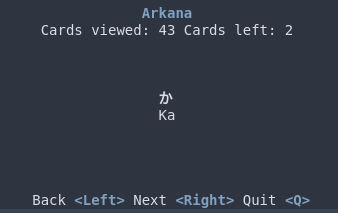

# Arkana 🧙‍♀️

> Another Rust Kana app

Arkana is a Hiragana / Katakana / Kanji (eventually) learning CLI app loosely based on Anki. It's similar to a flash-card system of learning.
The application is built by me to help me learn the Rust programming language, and to help me finally remember all the Japanese characters.
Feel free to contribute, star, raise issues, and generally help me through my Rust journey.



## Running

To run the program, simply clone the repository into a folder. `cd` into the newly created folder and run `cargo run`.

## Options

To use a custom CSV file, you can use the `-f` (--csv) flag. Arkana expects an CSV in the following format.

```CSV
front,back
16 + 16, 32
```
